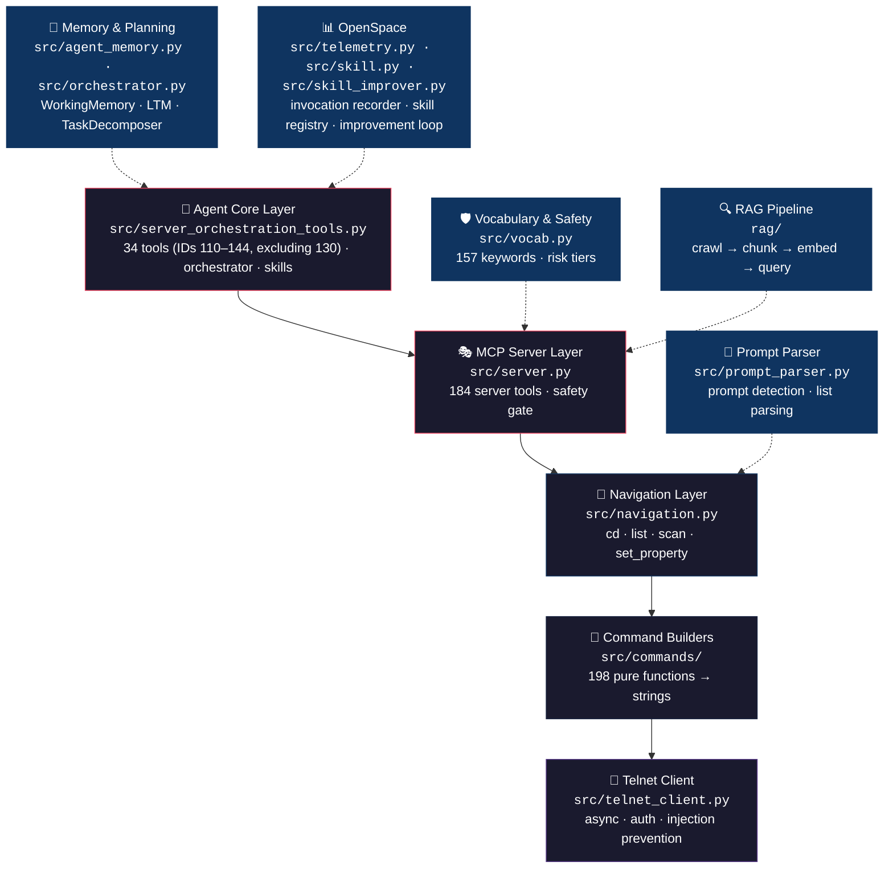

<p align="center">
  
</p>

# MA2 Agent

<p align="center">
  <a href="https://github.com/drohi-r/grandma2-mcp/actions/workflows/test.yml"></a>
  <a href="https://github.com/drohi-r/grandma2-mcp/blob/main/LICENSE"></a>
  
  
  
</p>

> Forked from [thisis-romar/ma2-onPC-MCP](https://github.com/thisis-romar/ma2-onPC-MCP) (originally built by [chienchuanw](https://github.com/chienchuanw)) — hardened and maintained by [@drohi-r](https://github.com/drohi-r).

**An AI agent for grandMA2 lighting consoles.** Exposes 218 grandMA2 operations as [Model Context Protocol](https://modelcontextprotocol.io/) tools so AI assistants (Claude Desktop, VS Code, etc.) can drive a lighting console via Telnet. Includes a built-in orchestrator, task decomposer, and long-term memory for fully autonomous lighting control.

<table>
<tr><td><b>Agent Harness</b></td><td>218 MCP tools covering every grandMA2 operation — playback, programming, user management, show files, busking, and more. Connect any MCP-compatible AI assistant and start controlling the console immediately.</td></tr>
<tr><td><b>Embedded Agent Core</b></td><td>Orchestrator, task decomposer, working + long-term memory, and a skill registry with self-improvement suggestions. Inject a real LLM client and it becomes a fully autonomous lighting agent that plans, executes, remembers, and learns.</td></tr>
<tr><td><b>Layered safety gate</b></td><td>Three risk tiers enforced before any command reaches the console: <code>SAFE_READ</code> (always allowed), <code>SAFE_WRITE</code> (standard mode), <code>DESTRUCTIVE</code> (blocked until <code>confirm_destructive=True</code>). Line-break injection rejected at the transport layer.</td></tr>
<tr><td><b>A closed learning loop</b></td><td>Every tool call recorded to <code>tool_invocations</code>. SkillImprover surfaces repair suggestions from failure patterns and promotion candidates from high-quality sessions. Skills are versioned playbooks with full lineage tracking.</td></tr>
<tr><td><b>RAG-powered knowledge</b></td><td>Three indexed sources: this repo, ~1,043 grandMA2 help pages, and the MCP SDK. Semantic search via GitHub Models embeddings; falls back to keyword search without an API token.</td></tr>
</table>

[Quick Start](#quick-start) · [Architecture](#architecture) · [218 MCP Tools](#mcp-tools) · [Resources](#mcp-resources) · [Prompts](#mcp-prompts) · [Skills](#agent-skills) · [Safety System](#safety-system) · [RAG Pipeline](#rag-pipeline)

---

## Quick Start

```bash
# 1. Install
git clone https://github.com/drohi-r/grandma2-mcp && cd grandma2-mcp
uv sync

# 2. Configure
cp .env.template .env        # then edit with your console IP

# 3. Install git hooks (auto-updates RAG index on every commit)
make install-hooks

# 4. Run
uv run python -m src.server  # starts MCP server (stdio transport)
```

> [!TIP]
> **Semantic search:** Add `GITHUB_MODELS_TOKEN=ghp_...` to `.env`, then run
> `uv run python scripts/rag_ingest.py --provider github` once to rebuild the index with
> real embeddings. The `search_codebase` MCP tool will automatically use semantic ranking
> when the token is present.

## Architecture



> All network I/O is isolated in `telnet_client.py`. Command builders are pure functions that return strings. The navigation layer orchestrates cd/list workflows with parsed telnet feedback.

### Agent Harness vs. Agent Core

MA2 Agent is a **layered hybrid** — the boundary is explicit in the code:

| Layer | What it is | Key files |
|-------|-----------|-----------|
| **Bottom 184 server tools** | **Agent Harness** — exposes the core MCP tool surface to an external AI; the reasoning loop lives in Claude Desktop, VS Code, etc. | `src/server.py` |
| **Top 34 orchestration tools** | **Embedded Agent Core** — orchestrator, task decomposer, long-term memory, skill registry | `src/server_orchestration_tools.py`, `src/orchestrator.py` |

The orchestrator accepts a `sub_agent_fn` injection point. Without it, tool calls run in-process. Wire in a Claude API client and MA2 Agent becomes a fully autonomous agent that plans, executes, remembers, and improves itself.

### Module Overview

| Module | Role |
|--------|------|
| `src/server.py` | FastMCP server, 184 interactive tools, safety gate, env config |
| `src/server_orchestration_tools.py` | 34 agentic tools (IDs 110–144, excluding 130) registered onto FastMCP |
| `src/orchestrator.py` | Multi-agent task runner: hydration, risk-tier isolation, LTM; `_showfile_guard()`, `check_showfile()` for dynamic show change detection |
| `src/task_decomposer.py` | Natural-language goal → ordered SubTask plan (rule-based) |
| `src/agent_memory.py` | WorkingMemory (ephemeral) + LongTermMemory (SQLite session log) + showfile baseline tracking (`baseline_showfile`, `showfile_changed()`) |
| `src/console_state.py` | ConsoleStateSnapshot: hydrates 19 show-memory gaps; `parse_showfile_from_listvar()` |
| `src/pool_name_index.py` | In-memory pool name/ID registry — zero-cost object resolution |
| `src/rights.py` | MA2 native rights enforcement + telnet feedback classification |
| `src/auth.py` | OAuth 2.1 scope enforcement (`@require_scope`, `@require_ma2_right`) |
| `src/credentials.py` | OAuth tier → console user credential resolver |
| `src/session_manager.py` | Per-operator Telnet session pool (LRU, keepalive, auto-reconnect) |
| `src/navigation.py` | cd + list + scan orchestration |
| `src/prompt_parser.py` | Parse console prompts and `list` tabular output |
| `src/vocab.py` | 157 keywords, `RiskTier`, `FunctionalDomain`, safety classification |
| `src/commands/` | 198 exported command-builder functions, grouped by keyword type |
| `src/commands/busking.py` | 6 busking/performance builders: effect assign, rate/speed, page release, fader zero |
| `src/categorization/` | ML tool categorization: K-Means clustering + auto-labeling |
| `src/telemetry.py` | Per-tool invocation recorder: `tool_invocations` table, latency, risk tier |
| `src/skill.py` | `Skill` dataclass + `SkillRegistry`: versioned playbooks with lineage + filesystem skill fallback (`_load_filesystem_skill`, `_list_filesystem_skills`) |
| `src/skill_improver.py` | `SkillImprover`: repair suggestions + promotion candidates (read-only) |
| `src/tools.py` | Global GMA2 telnet client accessor — `get_client()` used by all tools |

## Configuration

Create a `.env` file (see `.env.template`):

```env
# grandMA2 Console
GMA_HOST=192.168.1.100     # grandMA2 console IP (required)
GMA_USER=administrator     # default: administrator
GMA_PASSWORD=admin         # default: admin
GMA_PORT=30000             # default: 30000 (30001 = read-only)
GMA_SAFETY_LEVEL=standard  # standard (default), admin, or read-only
LOG_LEVEL=INFO             # default: INFO

# RAG Pipeline (optional)
GITHUB_MODELS_TOKEN=                          # GitHub PAT with models:read scope
RAG_EMBED_MODEL=openai/text-embedding-3-small # embedding model
RAG_EMBED_DIMENSIONS=1536                     # vector dimensions
```

> [!NOTE]
> Get a GitHub PAT with the `models:read` scope at [github.com/settings/tokens](https://github.com/settings/tokens).

| Level | Behavior |
|-------|----------|
| `read-only` | Only `SAFE_READ` commands allowed (`list`, `info`, `cd`) |
| `standard` | `SAFE_READ` + `SAFE_WRITE` allowed; `DESTRUCTIVE` requires `confirm_destructive=True` |
| `admin` | All commands allowed without confirmation |

## MCP Tools

The server exposes **218 tools** to MCP clients, grouped into 15 categories plus an agentic orchestration layer:

<details>
<summary><strong>🧭 Navigation & Inspection</strong> — 4 tools</summary>

| Tool | Description |
|------|-------------|
| `navigate_console` | Navigate the console object tree via ChangeDest (cd) |
| `get_console_location` | Query the current console destination without navigating |
| `list_console_destination` | List objects at the current destination with parsed entries |
| `scan_console_indexes` | Batch scan numeric indexes at any tree level |

```
cd /            → go to root
cd ..           → go up one level
cd Group.1      → navigate to Group 1 (dot notation)
cd 5            → navigate by element index
cd "MySeq"      → navigate by name
list            → enumerate objects at current destination
```

**Dot notation:** MA2 uses `[object-type].[object-id]` for object references (e.g., `Group.1`, `Preset.4.1`, `Sequence.3`).

</details>

<details>
<summary><strong>💡 Lighting Control</strong> — 7 tools</summary>

| Tool | Description |
|------|-------------|
| `set_intensity` | Set dimmer level on fixtures, groups, or channels |
| `set_attribute` | Set attribute values (Pan, Tilt, Zoom, etc.) on fixtures/groups |
| `apply_preset` | Apply a stored preset (color, position, gobo, beam, etc.) |
| `clear_programmer` | Clear programmer state (all, selection, active, or sequential) |
| `park_fixture` | Park a fixture/channel at its current or a specified value |
| `unpark_fixture` | Release a park lock on a fixture/channel |
| `fix_locate_fixture` | Fix (park) or Locate selected/specified fixtures at their defaults |

</details>

<details>
<summary><strong>🎯 Programmer / Selection</strong> — 8 tools</summary>

| Tool | Description |
|------|-------------|
| `modify_selection` | Select, deselect, or toggle fixtures in the programmer |
| `adjust_value_relative` | Adjust programmer values relatively (+ or –) |
| `manipulate_selection` | Invert or Align the current fixture selection / programmer values |
| `select_fixtures_by_group` | Select all fixtures in a named group |
| `select_executor` | Set the active executor for subsequent operations (single-selection only; use deselect=True to clear) |
| `select_feature` | Set active Feature context (updates `$PRESET`/`$FEATURE`/`$ATTRIBUTE`) |
| `select_preset_type` | Activate a PresetType context (PresetType 1–9 or by name) |
| `if_filter` | Apply an IfOutput / IfActive filter to limit programmer scope |

</details>

<details>
<summary><strong>▶️ Playback & Executor</strong> — 9 tools</summary>

| Tool | Description |
|------|-------------|
| `execute_sequence` | Legacy sequence playback: go, pause, or goto cue |
| `playback_action` | Full playback: go, go_back, goto, fast_forward, fast_back, def_go, def_go_back, def_pause |
| `control_executor` | Control an executor (go, pause, stop, flash, etc.) |
| `load_cue` | Pre-load the next or previous cue on an executor without firing it |
| `get_executor_status` | Query status of an executor (current cue, level, state) |
| `set_executor_level` | Set the fader level on an executor |
| `navigate_page` | Navigate to a specific page or page +/– |
| `release_executor` | Release (deactivate) an executor |
| `blackout_toggle` | Toggle grandmaster blackout on/off |

</details>

<details>
<summary><strong>playback_action</strong> — parameters &amp; response fields</summary>

#### Parameters

| Parameter | Type | Description |
|-----------|------|-------------|
| `action` | `str` | One of the actions below |
| `object_type` | `str \| None` | Object type for `go`/`go_back` (e.g. `"executor"`, `"sequence"`) |
| `object_id` | `int \| list[int] \| None` | ID or list of IDs — list produces `N + M + …` syntax |
| `cue_id` | `int \| float \| None` | Required for `"goto"` |
| `end` | `int \| None` | End of range for `go`/`go_back` (builds `thru N`) |
| `cue_mode` | `str \| None` | `"normal"`, `"assert"`, `"xassert"`, or `"release"` |
| `executor` | `int \| list[int] \| None` | Executor ID(s) for `goto`/`fast_forward`/`fast_back` — list produces `N + M + …` |
| `sequence` | `int \| None` | Sequence ID for `goto`/`fast_forward`/`fast_back` |

#### Actions

| Action | Command sent | Notes |
|--------|-------------|-------|
| `"go"` | `go [object_type] [id]` | Fires next cue; `object_id` accepts a list |
| `"go_back"` | `goback [object_type] [id]` | Fires previous cue; `object_id` accepts a list |
| `"goto"` | `goto cue N [executor/sequence]` | Pre-flight validates cue exists; returns `blocked=True` on Error #72 |
| `"fast_forward"` | `>>> [executor N]` | `executor` accepts a list |
| `"fast_back"` | `<<< [executor N]` | `executor` accepts a list |
| `"def_go"` | `defgoforward` | Fires on `$SELECTEDEXEC`; reads state before firing |
| `"def_go_back"` / `"def_goback"` | `defgoback` | Same — `def_goback` is an alias |
| `"def_pause"` | `defgopause` | Same |

#### Response fields

All actions return `command_sent` and `raw_response`.

`def_go`, `def_go_back`, and `def_pause` additionally return:

| Field | Value |
|-------|-------|
| `selected_executor` | Value of `$SELECTEDEXEC` read **before** the command was sent (`null` if unavailable) |
| `selected_cue_before` | Value of `$SELECTEDEXECCUE` read before the command (`null` if unavailable) |

`goto` additionally returns `cue_exists`, `cue_probe_response`, and optionally `executor_probe_response`.

#### Examples

```python
# Fire next cue on executors 1, 2, and 3 simultaneously
playback_action(action="go", object_type="executor", object_id=[1, 2, 3])
# → go executor 1 + 2 + 3

# Fast-forward executors 2 and 4
playback_action(action="fast_forward", executor=[2, 4])
# → >>> executor 2 + 4

# Go back on the selected executor — response tells you which one fired
playback_action(action="def_go_back")
# → {"command_sent": "defgoback", "selected_executor": "5", "selected_cue_before": "3"}
```

</details>

<details>
<summary><strong>select_executor</strong> — parameters &amp; response fields</summary>

**Single-selection only.** MA2 telnet `select executor N` accepts exactly one executor number. There is no list syntax — pass a single `executor_id` integer.

#### Parameters

| Parameter | Type | Default | Description |
|-----------|------|---------|-------------|
| `executor_id` | `int` | required | Executor number (1–999) |
| `page` | `int \| None` | `None` | Page number — produces `select executor page.id` (e.g. `page=2, executor_id=5` → `select executor 2.5`) |
| `deselect` | `bool` | `False` | If `True`, sends bare `select` to clear the current selection (**unverified on grandMA2 telnet** — inspect `raw_response`) |

#### Response fields

| Field | Always present | Description |
|-------|---------------|-------------|
| `command_sent` | ✓ | The exact command sent |
| `raw_response` | ✓ | Raw telnet reply |
| `confirmed_selected_exec` | ✓ | Value of `$SELECTEDEXEC` read after the command (`null` if unavailable) |
| `risk_tier` | ✓ | `"SAFE_WRITE"` |
| `warning` | if mismatch | Present when `confirmed_selected_exec` doesn't match the requested `executor_id` |
| `note` | if deselect | Present when `deselect=True` — warns that bare `select` behaviour is unverified |

#### Page-qualified addressing

When `page` is supplied, MA2 stores `$SELECTEDEXEC` as the executor number only (not the page-qualified form). The confirmation check compares against `executor_id` alone — no spurious warning.

#### Examples

```python
# Select executor 5 and confirm
select_executor(executor_id=5)
# → {"command_sent": "select executor 5", "confirmed_selected_exec": "5"}

# Select executor 5 on page 2
select_executor(executor_id=5, page=2)
# → {"command_sent": "select executor 2.5", "confirmed_selected_exec": "5"}

# Clear the current selection
select_executor(executor_id=1, deselect=True)
# → {"command_sent": "select", "note": "Bare 'select' sent … unverified …"}
```

</details>

<details>
<summary><strong>💾 Programming / Store</strong> — 13 tools</summary>

| Tool | Description |
|------|-------------|
| `create_fixture_group` | Select a range of fixtures and save as a named group |
| `store_current_cue` | Store programmer state into a cue |
| `store_new_preset` | Store programmer state as a new preset |
| `store_object` | Store generic objects — macros, effects, worlds, etc. |
| `store_cue_with_timing` | Store a cue with explicit fade/delay timing |
| `update_cue_data` | Update an existing cue with current programmer values |
| `set_cue_timing` | Edit fade, delay, or trigger timing on an existing cue |
| `set_sequence_property` | Set a property on a sequence (e.g. looping, autoprepare) |
| `assign_cue_trigger` | Assign a trigger type (Go, Follow, Time) to a cue |
| `block_unblock_cue` | Block or Unblock a cue to freeze/restore its tracked values |
| `clone_object` | Clone (duplicate with data) one or more objects to new IDs |
| `remove_from_programmer` | Remove specific fixtures or channels from the programmer |
| `run_macro` | Execute a stored macro by ID |

> [!WARNING]
> Store tools are **DESTRUCTIVE** — they require `confirm_destructive=True`.

</details>

<details>
<summary><strong>⏱️ Timecode & Timer</strong> — 3 tools</summary>

| Tool | Description |
|------|-------------|
| `control_timecode` | Start, stop, or jump a timecode show |
| `control_timer` | Start, stop, or reset a timer |
| `store_timecode_event` | Store an event into a timecode show at the current time |

</details>

<details>
<summary><strong>🔗 Assignment & Layout</strong> — 9 tools</summary>

| Tool | Description |
|------|-------------|
| `assign_object` | Assign objects, functions, fades, or layout positions |
| `assign_executor_property` | Assign any of 22 settable options on an executor (width, priority, autostart, etc.) — page-qualified |
| `get_executor_state` | Read all 32 fields of one executor via `List Executor page.id` (SAFE_READ) |
| `scan_page_executor_layout` | Map executor slot occupancy on a page — required pre-flight before width expansion (SAFE_READ) |
| `discover_fixture_type_attributes` | Discover fixture type attribute names via EditSetup tree navigation (SAFE_READ) |
| `label_or_appearance` | Label or set visual appearance of objects |
| `edit_object` | Edit, cut, or paste objects |
| `cut_paste_object` | Cut an object to clipboard, or paste clipboard content at a location |
| `remove_content` | Remove content from objects — fixtures, effects, preset types |
| `save_recall_view` | Save or recall a screen view configuration |
| `set_executor_priority` | Set playback priority on an executor (super/high/normal/low/htp/swap) |
| `set_node_property` | Set a property on any node via dot-separated tree path (DESTRUCTIVE) |

</details>

<details>
<summary><strong>📁 Show Management</strong> — 7 tools</summary>

| Tool | Description |
|------|-------------|
| `save_show` | Save the current show file to disk |
| `list_shows` | List available show files on the console |
| `load_show` | Load a show file by name |
| `new_show` | Create a new empty show |
| `delete_show` | Delete a show file from disk |
| `export_objects` | Export show objects (groups, presets, macros, etc.) to a file |
| `import_objects` | Import objects from a file into the show |

> [!CAUTION]
> `new_show` without `preserve_connectivity=True` **disables Telnet**, severing the MCP connection.

</details>

<details>
<summary><strong>🔌 Fixture Setup & Patch</strong> — 16 tools</summary>

| Tool | Description |
|------|-------------|
| `list_fixture_types` | List fixture types loaded in the show |
| `list_layers` | List fixture layers in the patch |
| `list_universes` | List configured DMX universes |
| `list_library` | Browse the MA2 fixture library |
| `list_fixtures` | List fixtures currently patched in the show |
| `browse_patch_schedule` | Browse the DMX patch schedule |
| `patch_fixture` | Patch a fixture to a DMX universe and address |
| `unpatch_fixture` | Remove a fixture's DMX patch assignment |
| `set_fixture_type_property` | Set a property on a fixture type |
| `manage_matricks` | Manage MAtricks (fixture matrix) objects |
| `create_matricks_library` | Generate combinatorial MAtricks pool with 25-color coding |
| `store_matricks_preset` | Combined set + store + label MAtricks preset workflow |
| `create_filter_library` | Generate color-coded Filter library with V/VT/E variants |
| `import_fixture_type` | Import a fixture type from the MA2 library |
| `import_fixture_layer` | Import a fixture layer XML file into the show patch |
| `generate_fixture_layer_xml` | Generate a grandMA2 fixture layer XML file for import |

<details>
<summary>Fixture import workflow</summary>

```python
# 1. Generate the XML file
generate_fixture_layer_xml(
    filename="my_dimmers",
    layer_name="Dimmers",
    layer_index=1,
    fixtures=[
        {"fixture_id": 1, "name": "Dim 1", "fixture_type_no": 2,
         "fixture_type_name": "2 Dimmer 00", "dmx_address": 1, "num_channels": 1},
    ],
    showfile="myshow",
)

# 2. Import the fixture type from library
import_fixture_type(
    manufacturer="Martin",
    fixture="Mac700Profile_Extended",
    mode="Extended",
    confirm_destructive=True,
)

# 3. Import the layer
import_fixture_layer(filename="my_dimmers", layer_index=1, confirm_destructive=True)
```

</details>

<details>
<summary>MAtricks combinatorial library</summary>

Generates every combination of Wings × Groups × Blocks × Interleave (5⁴ = 625 items) with a **25-color scheme** embedded directly in the XML:

| Dimension | Controls | Values |
|-----------|----------|--------|
| **Wings** | Hue | Red (0°) · Yellow-Green (72°) · Cyan (144°) · Blue (216°) · Magenta (288°) |
| **Groups** | Brightness | 100% · 80% · 60% · 45% · 30% |
| Blocks | — | 0–4 |
| Interleave | — | 0–4 |

Colors use `<Appearance Color="RRGGBB" />` in the XML — import is instant, no telnet loop required.

```bash
# Full library (625 items)
python -m scripts.create_matricks_library --max-value 4

# Quick test (16 items)
python -m scripts.create_matricks_library --max-value 1

# XML only (no telnet import)
python -m scripts.create_matricks_library --xml-only

# Re-apply colors via telnet (if needed)
python -m scripts.create_matricks_library --color-only
```

</details>

</details>

<details>
<summary><strong>🔎 Info, Queries & Discovery</strong> — 15 tools</summary>

| Tool | Description |
|------|-------------|
| `get_object_info` | Query info on any object (fixture, group, sequence, etc.) |
| `query_object_list` | List cues, groups, presets, attributes, or messages |
| `get_variable` | Get the current value of a console variable |
| `list_system_variables` | List all 26 built-in system variables (`$TIME`, `$SHOWFILE`, etc.) |
| `list_sequence_cues` | List all cues in a sequence with timing and labels |
| `discover_object_names` | Discover named objects in a pool via the cd tree |
| `check_pool_availability` | Check which slots are occupied and free in an object pool |
| `browse_preset_type` | Browse Feature/Attribute/SubAttribute tree for a PresetType |
| `list_preset_pool` | List presets in the Global preset pool by type |
| `browse_effect_library` | Browse the grandMA2 effect library |
| `browse_macro_library` | Browse the grandMA2 macro library |
| `browse_plugin_library` | Browse the grandMA2 plugin library |
| `highlight_fixtures` | Toggle highlight mode for selected fixtures |
| `list_undo_history` | List recent undo history entries |
| `discover_filter_attributes` | Discover show-specific filter attributes from patched fixtures |

</details>

<details>
<summary><strong>⚙️ Console & Utilities</strong> — 8 tools</summary>

| Tool | Description |
|------|-------------|
| `send_raw_command` | Send any MA command directly (safety-gated) |
| `copy_or_move_object` | Copy or move objects between slots (with merge/overwrite) |
| `delete_object` | Delete any object by type and ID |
| `manage_variable` | Set or add to console variables (global or user-scoped) |
| `undo_last_action` | Undo the last console action |
| `toggle_console_mode` | Toggle console modes: blind, highlight, freeze, solo |
| `list_fader_modules` | List connected fader modules and their configuration |
| `list_update_history` | List programming update history |

</details>

<details>
<summary><strong>👤 User Management</strong> — 5 tools</summary>

| Tool | Description |
|------|-------------|
| `list_console_users` | List all user profiles configured on the console |
| `create_console_user` | Create a new user profile with name and password |
| `delete_user` | Delete a user profile |
| `inspect_sessions` | Inspect active Telnet sessions and connected operators |
| `assign_world_to_user_profile` | Assign a world (visibility scope) to a user profile |

> [!NOTE]
> Requires `GMA_SCOPE=gma2:user:manage` (Admin tier). Bootstrap 5 default user accounts
> with `python scripts/bootstrap_console_users.py`.

</details>

<details>
<summary><strong>🤖 ML-Based Tool Discovery</strong> — 4 tools</summary>

| Tool | Description |
|------|-------------|
| `list_tool_categories` | Browse auto-discovered tool categories via K-Means clustering |
| `recluster_tools` | Re-run the full ML pipeline (extract → embed → cluster → label) |
| `get_similar_tools` | Find the most similar tools by Euclidean distance in feature space |
| `suggest_tool_for_task` | Suggest tools for a natural-language task description |

</details>

<details>
<summary><strong>🔍 Codebase Search / RAG</strong> — 1 tool</summary>

| Tool | Description |
|------|-------------|
| `search_codebase` | Semantic search over the indexed codebase and MA2 docs |

</details>

<details>
<summary><strong>🤖 Orchestration & Console State</strong> — 34 tools</summary>

These tools form the **agentic layer** (`src/server_orchestration_tools.py`). They enable
multi-step task execution with memory, risk-tier isolation, and zero-telnet state queries
via a `ConsoleStateSnapshot` cache that closes 19 show-memory gaps.

For the higher-level agent harness in `src/server.py`, prefer `plan_agent_goal` to preview
and `run_agent_goal` to execute. Use `decompose_task` / `run_task` when you specifically
want the lower-level rule-based orchestration surface in `src/server_orchestration_tools.py`.

#### Task Orchestration (Tools 110–118)

| Tool | Description |
|------|-------------|
| `decompose_task` | Break a lighting goal into an ordered multi-agent plan (review before execute) |
| `run_task` | Execute a full task with risk-tier isolation, memory, and state hydration |
| `list_agent_sessions` | List recent task sessions from long-term memory |
| `recall_agent_session` | Restore WorkingMemory snapshot from a past session |
| `agent_token_report` | Report token consumption across agent sessions |
| `register_decomposition_rule` | Register a custom task-decomposition rule at runtime |
| `resolve_object_ref` | Resolve a pool object name/ID to a quoted MA2 token (zero telnet) |
| `list_pool_names` | List all names and IDs for a pool type from the in-memory index |
| `hydrate_console_state` | Trigger a fresh ConsoleStateSnapshot hydration |

#### Console State Queries (Tools 119–129)

Read from the cached snapshot — **no telnet round-trips required**.

| Tool | Description |
|------|-------------|
| `get_console_state` | Snapshot summary, age, and staleness warning |
| `get_park_ledger` | All currently parked fixtures |
| `get_filter_state` | Active filter ID and V/VT/E flag settings |
| `get_world_state` | Active world and visibility scope |
| `get_matricks_state` | Write-tracked MAtricks state (interleave, blocks, wings, etc.) |
| `get_programmer_selection` | `$SELECTEDFIXTURESCOUNT`, `$SELECTEDEXEC`, `$SELECTEDEXECCUE` |
| `hydrate_sequences` | Deep-hydrate specific sequence cues and parts |
| `get_sequence_memory` | Sequence properties and CueRecords from the snapshot |
| `assert_selection_count` | Validate fixture selection count against an expected value |
| `assert_preset_exists` | Pre-flight check: verify a preset slot is occupied |
| `get_executor_detail` | Full ExecutorState for a given executor ID |

#### Orchestration Safety & Diagnostics (Tools 131–137)

| Tool | Description |
|------|-------------|
| `diff_console_state` | Compare current snapshot against a caller-supplied baseline; returns changed fields |
| `get_showfile_info` | Return showfile name, version, host status, and active user from snapshot (zero telnet) |
| `watch_system_var` | Poll a grandMA2 system variable until it changes or a timeout is reached |
| `confirm_destructive_steps` | Decompose a goal and return only the DESTRUCTIVE steps for human review |
| `abort_task` | Mark a running session as aborted and return completed/failed step summary |
| `retry_failed_steps` | Reload a past session from LTM and re-run the original goal |
| `assert_fixture_exists` | Two-tier fixture patch validation (snapshot index → live telnet fallback) |

#### OpenSpace Layer — Telemetry, Skills & Improvement (Tool IDs 110–144, excluding 130)

| Tool | Scope | Description |
|------|-------|-------------|
| `get_tool_metrics` | DISCOVER | Latency + error-rate stats for any tool over N days |
| `list_skills` | DISCOVER | Search the skill registry by name, description, or context |
| `get_skill` | DISCOVER | Full detail + lineage chain for a single skill |
| `promote_session_to_skill` | PROGRAMMER_WRITE | Manually promote a completed session to a named, versioned skill |
| `get_improvement_suggestions` | DISCOVER | Repair suggestions (failing tools) + promotion candidates (successful sessions) |
| `approve_skill` | SYSTEM_ADMIN | Human-gate: set `approved=True` on a DESTRUCTIVE-scope skill before agents may use it |
| `assert_showfile_unchanged` | DISCOVER | Verify open show matches hydration baseline — live ListVar vs cached snapshot |

#### Compliance, Patch Validation & Cross-Venue Tools

| Tool | Scope | Description |
|------|-------|-------------|
| `detect_dmx_address_conflicts` | DISCOVER | Scan all universes for overlapping fixture DMX address assignments |
| `get_telemetry_report` | DISCOVER | Export tool invocation telemetry as JSON or markdown audit log |
| `generate_compliance_report` | DISCOVER | SB 132 / safety-audit compliance report from session telemetry |
| `validate_preset_references` | DISCOVER | Scan cue list for references to deleted or missing preset pool entries |
| `list_macro_jump_targets` | DISCOVER | Parse macro lines and extract all jump targets for index-shift planning |
| `check_pool_slot_availability` | DISCOVER | Pre-flight: which pool slots are empty vs. occupied in a range |
| `remap_fixture_ids` | PROGRAMMER_WRITE | Remap fixture references from one ID to another in groups after PSR import |

> [!NOTE]
> Call `hydrate_console_state` before using state-query tools. The snapshot caches values
> that have no direct telnet readback (MAtricks state, park ledger, filter VTE flags, etc.).
> Check freshness with `get_console_state`.

</details>

<details>
<summary><strong>🎛️ Busking &amp; Performance</strong> — 6 tools</summary>

| Tool | Description |
|------|-------------|
| `assign_temp_fader` | Set the temp fader level on the currently selected executor |
| `assign_effect_to_executor` | Bind an effect template to an executor slot (DESTRUCTIVE — requires `confirm_destructive=True`) |
| `modulate_effect` | Set rate (`EffectRate`) or speed (`EffectSpeed`) on active effects |
| `clear_effects_on_page` | Release all effect executors on a page range |
| `normalize_page_faders` | Set all faders on a page to 0 without releasing |
| `classify_show_mode` | Inspect executor assignments and classify show as `busking`, `sequence`, `hybrid`, or `empty` |

</details>

## MCP Resources

Thirteen read-only resources exposable to any MCP client. Use them for zero-telnet context before calling tools.

| URI | Description |
|-----|-------------|
| `ma2://docs/rights-matrix` | OAuth scope → MA2Right mapping matrix (JSON) |
| `ma2://docs/vocab-summary` | All 157 keywords with RiskTier and category (JSON) |
| `ma2://docs/tool-taxonomy` | ML-clustered tool taxonomy — 218 tools clustered into 14 categories (JSON) |
| `ma2://docs/responsibility-map` | Module responsibility map for architectural decisions (Markdown) |
| `ma2://docs/tool-surface-tiers` | Tier A/B/C classification for every tool (Markdown) |
| `ma2://docs/volunteer-guide` | Plain-language volunteer operator guide: three-tier access model + Sunday preflight |
| `ma2://docs/sb132-compliance` | SB 132 / CA Film Tax Credit safety documentation mapped to telemetry fields |
| `ma2://docs/rdm-workflow` | RDM discovery, autopatch, and device info best practices |
| `ma2://docs/lua-scripting` | grandMA2 Lua 5.2 scripting reference: `gma.*` namespace + common patterns |
| `ma2://skills/{skill_id}` | Skill injection payload by ID — returns formatted user message ready for agent injection |
| `ma2://busking/patterns` | Best-practice busking patterns: fader model, song macro protocol, live recovery |
| `ma2://busking/effect-design` | Effect-to-executor assignment patterns, rate vs speed, MAtricks layering |
| `ma2://busking/color-design` | HSB palette strategy, preset numbering, monochromatic constraint, color lock |

All resources are read-only — no console side-effects.

## MCP Prompts

Ten workflow prompts that orchestrate tools into guided multi-step procedures.

| Prompt | Args | Description |
|--------|------|-------------|
| `preflight_destructive_change` | `operation`, `target`, `reason` | Safety pre-flight checklist before any DESTRUCTIVE tool call — checks rights, target existence, blind mode, and executor state |
| `inspect_console` | `focus` | Guided read-only console state inspection — `full`, `playback`, `fixtures`, `show`, or `rights` |
| `plan_cue_store` | `sequence_id`, `cue_number`, `fixture_selection`, `preset_or_values` | Plan a cue store operation with pre-flight and verification steps — does not execute |
| `diagnose_playback_failure` | `executor_id`, `symptom` | Structured playback failure diagnosis — returns `fault_class`, `root_cause`, `recommended_actions` |
| `load_show_safely` | `show_name` | Safe show loading checklist — prevents accidental Telnet disconnection via missing `/globalsettings` |
| `bootstrap_rights_users` | *(none)* | Guided provisioning of the six-tier MA2 rights user accounts |
| `volunteer_sunday_preflight` | `show_name`, `campus_name` | SAFE_READ preflight for volunteer operators — GREEN/AMBER/RED show verification before service |
| `generate_busking_template` | `target_page`, `fixture_strategy` | Build a complete busking template from current patch — groups, presets, effects, executor layout |
| `pre_show_health_check` | `sequence_ids`, `strict` | Full show health audit — showfile, presets, executors, cues, parks, and DMX with scored findings |
| `adapt_show_to_venue` | `source_show_description`, `new_venue_notes` | Cross-venue show adaptation — patch comparison, group remapping, preset verification |

## Agent Skills

Forty-five instruction modules in `.claude/skills/` are injected as user messages into agent conversations. They teach agents domain-specific workflows without embedding knowledge in tool docstrings.

| Skill | Description |
|-------|-------------|
| `ma2-command-rules` | MA2 command construction, object resolution, quoting rules, and safety escalation |
| `telnet-feedback-triage` | Classify and summarise grandMA2 Telnet feedback using the `FeedbackClass` enum |
| `feedback-investigator` | Worker playbook: classify and investigate Telnet feedback failures |
| `cue-list-auditor` | Worker playbook: audit cue list gaps, labels, timing, and health |
| `operator-recovery-runbook` | On-site incident response for stuck playback, contaminated programmer, wrong world/filter, and similar show emergencies |
| `busking-lighting-performance` | Live busking — fader-per-effect model, executor layout, effect layering, live recovery |
| `song-macro-page-design` | Song macro pages — first-button protocol, executor column layout, jump target safety |
| `constrained-color-design` | Monochromatic HSB palette design — preset numbering, color lock, song-to-palette mapping |
| `preset-library-architect` | Build full dimmer/position/color/gobo preset pools from raw attribute values |
| `preset-impact-manager` | Assess preset updates or deletions safely by tracing downstream cue and showfile references |
| `patch-and-group-builder` | Patch fixtures, build groups by type/position, and verify selection counts |
| `festival-stage-setup` | End-to-end one-off festival workflow from patched rig to busking-ready showfile |
| `fixture-swap-surgeon` | Analyze fixture substitutions and plan compatible swap + migration steps |
| `chaser-builder` | Step-based chasers, running lights via MAtricks, strobes — speed/rate/direction control |
| `cue-tracking-and-timing` | Tracking vs non-tracking, Block/Unblock, MIB, timing layers, trigger types, Update vs Store |
| `tracking-debugger` | Diagnose tracking leaks, unexpected blocks, and cue inheritance problems in sequences |
| `cue-to-cue-rehearsal` | Guided cue-by-cue walkthrough with state summaries and cue diffs during rehearsal |
| `executor-configuration` | Executor priority, trigger types, fader functions, speed masters, protect options |
| `show-management-and-psr` | Save/Load/New show (connectivity preservation), PSR workflow, Export/Import XML |
| `macro-advanced` | SetVar/SetUserVar, conditionals, CmdDelay, jump targets, XML authoring, Store Group timing |
| `macro-linter-and-refactorer` | Inspect macros for unsafe patterns, broken jumps, and cleanup opportunities |
| `clone-and-data-transfer` | Clone fixture with `/selective`, copy/move pool objects, cue-range copy, cross-show PSR |
| `effect-programmer` | Build effects from scratch, layer rate/speed/phase, assign to executors |
| `world-filter-designer` | Create worlds, assign fixtures, configure filter objects, control visibility |
| `timecode-show-programmer` | Build timecode shows, assign events to cues, enable/disable tracks |
| `color-preset-creator` | Store universal color presets from RGB values — builds the preset pool |
| `color-palette-sequence-builder` | Build a cue sequence where each cue references a universal color preset |
| `auto-layout-color-picker` | Preflight and run the installed auto-layout color picker plugin safely — groups, ranges, images, layout, and post-run verification |
| `hue-palette-creator` | Store 96 universal hue presets (4.101–4.196) using the HSB color model |
| `hue-sequence-builder` | Build a 16-cue sequence from an adjacent hue pair — 8 saturation variants per hue |
| `sequence-executor-assigner` | Assign a sequence to a free executor so it appears as a playback fader |
| `rdm-workflow` | RDM discovery → device info → autopatch workflow via MCP |
| `lua-and-plugins` | Lua 5.2 scripting with `gma.*` namespace, plugin invocation, and reload lifecycle |
| `troubleshoot-no-output` | Systematic no-output diagnostic from Grand Master and worlds down to DMX and fixture-level faults |
| `companion-integration` | Build Bitfocus Companion button pages that mirror the MA2 executor layout |
| `showkontrol-bpm-sync` | Sync CDJ tempo from ShowKontrol into MA2 speed masters for live BPM-locked effects |
| `psr-show-migration` | PSR with pre-flight slot check, fixture ID verification, and post-import diff |
| `compliance-documentation` | Generate SB 132 / insurance audit reports from session telemetry — SAFE_READ only |
| `volunteer-operations` | Three-tier access model, Sunday morning preflight, and incident response for non-programmers |
| `view-and-layout-designer` | Custom console views, executor button placement, image assignment, sheet recall |
| `show-health-check` | Pre-show audit — showfile, presets, executors, cues, parks, DMX. Returns GREEN/AMBER/RED |
| `busking-template-generator` | Build a complete busking template from any patched rig — groups, presets, effects, executor page |
| `cross-venue-adaptation` | Adapt show to a new venue rig — patch comparison, group remapping, preset scope verification |
| `training-mode` | Annotated SAFE_READ console tour for students, church volunteers, and IATSE training programs |
| `remote-monitoring` | Continuous SAFE_READ polling — show change detection, alert conditions, broadcast and architectural protocols |

Skills are loaded on demand via `ma2://skills/{skill_id}` resource or injected by the orchestrator. Use `list_skills` / `get_skill` tools to browse and inspect them at runtime.

## Client Setup

### Claude Desktop

Add to your Claude Desktop config (`~/Library/Application Support/Claude/claude_desktop_config.json` on macOS):

```json
{
  "mcpServers": {
    "gma2": {
      "command": "uv",
      "args": ["--directory", "/path/to/grandma2-mcp", "run", "python", "-m", "src.server"],
      "env": {
        "GMA_HOST": "192.168.1.100",
        "GMA_USER": "administrator",
        "GMA_PASSWORD": "admin"
      }
    },
    "time": {
      "command": "npx",
      "args": ["-y", "@modelcontextprotocol/server-time"]
    }
  }
}
```

The `time` server provides accurate ISO 8601 timestamps for markdown front matter — required by `.claude/rules/markdown-frontmatter.md`. It is also registered automatically for Claude Code CLI via `.mcp.json` and for VS Code via `vscode-mcp-provider/`.

### VS Code

The `vscode-mcp-provider/` directory contains a VS Code extension that registers the grandMA2 MCP server for AI assistant discovery.

```bash
cd vscode-mcp-provider
npm install && npm run compile
# Then install in VS Code (F5 to debug, or package with vsce)
```

See [`vscode-mcp-provider/README.md`](vscode-mcp-provider/README.md) for full details.

## Safety System

MA2 Agent enforces a **3-layer model** where effective permissions are the intersection of all three — no single layer can expand privileges:

```
scope ∩ policy ∩ ma2_rights = FINAL AUTHORITY
```

### Layer 1 — OAuth Identity (`src/auth.py`)

Six scope tiers map to console users created by `scripts/bootstrap_console_users.py`:

| `GMA_SCOPE` | Console user | MA2 Rights | Can do |
|-------------|-------------|-----------|--------|
| `tier:0` | `guest` | None (0) | Read-only — list, info, cd |
| `tier:1` | `operator` | Playback (1) | Go, Flash, Off, timecode |
| `tier:2` | `presets_editor` | Presets (2) | Set attributes, apply/store presets |
| `tier:3` | `programmer` | Program (3) | Store cues, groups, sequences, macros |
| `tier:4` | `tech_director` | Setup (4) | Patch, fixture import, console setup |
| `tier:5` | `administrator` | Admin (5) | User management, show load/delete |

### Layer 2 — Policy Gate (`src/rights.py`)

Every tool is annotated with `@require_ma2_right(MA2Right.X)` which enforces the OAuth scope requirement before any Telnet command is sent. The `check_permission()` utility provides a unified gate combining scope and rights checks:

```python
result = check_permission("store_current_cue", granted_scopes, user_right)
# scope ∩ MA2Right — both must pass
if not result.allowed:
    return result.as_block_response()
```

All 218 tools are mapped in `doc/ma2-rights-matrix.json`.

### Layer 3 — MA2 Native Rights (console enforcement)

The Telnet session runs as a console user whose native rights are enforced by grandMA2 itself. Commands beyond that user's rights level are rejected with `Error #72` — an irrevocable floor that exists regardless of what Layer 1 or 2 permit.

> Bootstrap required: On a fresh show, run `python scripts/bootstrap_console_users.py` as Administrator to create the 5 intermediate users. Only `Administrator` and `Guest` exist natively.

### Risk Tiers (server-side gate)

In addition to the 3-layer model, every keyword is classified into one of three risk tiers enforced by `_handle_errors`:

| Tier | Description | Examples |
|------|-------------|----------|
| `SAFE_READ` | Read-only queries | `Info`, `List`, `CmdHelp`, `ChangeDest` |
| `SAFE_WRITE` | Reversible state changes | `Go`, `At`, `Clear`, `Park`, `SelFix` |
| `DESTRUCTIVE` | Data mutation or loss | `Delete`, `Store`, `Copy`, `Move`, `Shutdown` |

`DESTRUCTIVE` tools require `confirm_destructive=True` in addition to OAuth scope.

> [!IMPORTANT]
> **Command injection prevention:** Line breaks (`\r`, `\n`) are rejected before any command reaches the console.
> The telnet client also strips them as a defense-in-depth measure.

### Keyword Classification

The vocabulary classifies all **157 grandMA2 keywords** into categories:

| Category | Count | Description | Examples |
|----------|-------|-------------|----------|
| `OBJECT` | 56 | Console objects (nouns) | Channel, Fixture, Group, Preset, Executor |
| `FUNCTION` | 90 | Actions (verbs) | Store, Delete, Go, At, Kill, List, Info |
| `HELPING` | 5 | Syntax connectors | And, Thru, Fade, Delay, If |
| `SPECIAL_CHAR` | 6 | Operator symbols | Plus `+`, Minus `-`, Dot `.`, Slash `/` |

<details>
<summary>Object Keyword metadata</summary>

Object Keywords carry additional metadata from live telnet verification:

| Field | Description |
|-------|-------------|
| `context_change` | Whether the keyword changes the `[default]>` prompt context |
| `canonical` | Console-normalized spelling (e.g., `DMX` → `Dmx`) |
| `notes` | Behavior notes from live telnet testing |

Of the 56 Object Keywords: 53 change the default prompt context and 3 don't (`Full`, `Normal`, `Zero` — these set dimmer values). `Channel` and `Default` have `context_change=True`; their notes describe resetting the *default keyword*, not the prompt context.

**Console aliases:**

| Input | Resolves To |
|-------|-------------|
| `DMX` | `Dmx` |
| `DMXUniverse` | `DmxUniverse` |
| `Sound` | `SoundChannel` |
| `RDM` | `RdmFixtureType` |

</details>

<details>
<summary><code>classify_token()</code> example</summary>

```python
from src.vocab import build_v39_spec, classify_token

spec = build_v39_spec()

result = classify_token("Delete", spec)
# result.risk == RiskTier.DESTRUCTIVE
# result.canonical == "Delete"
# result.category == KeywordCategory.FUNCTION

result = classify_token("Channel", spec)
# result.risk == RiskTier.SAFE_WRITE
# result.category == KeywordCategory.OBJECT

result = classify_token("DMX", spec)
# result.canonical == "Dmx"  (alias resolution)
```

</details>

## RAG Pipeline


```bash
# Ingest repository with real embeddings
uv run python scripts/rag_ingest.py --provider github -v

# Semantic search
uv run python scripts/rag_query.py "store cue with fade" -v

# Text-only keyword search (no token needed)
uv run python scripts/rag_query.py "store cue with fade"
```

| Provider | Flag | Requires |
|----------|------|----------|
| GitHub Models | `--provider github` | `GITHUB_MODELS_TOKEN` |
| Zero-vector stub | `--provider zero` | Nothing (for testing) |
| Auto-detect | *(no flag)* | Uses GitHub if token set, otherwise zero-vector |

<details>
<summary>Pipeline stages</summary>

**Ingest**

| Stage | Module | Description |
|-------|--------|-------------|
| Crawl | `rag/ingest/crawl_repo.py` | Walk repo files, respect ignore patterns |
| Chunk | `rag/ingest/chunk.py` | Split into overlapping token-bounded chunks |
| Extract | `rag/ingest/extract.py` | Extract symbol names (functions, classes, headings) |
| Embed | `rag/ingest/embed.py` | Generate vectors via GitHub Models API |
| Store | `rag/store/sqlite.py` | Write chunks + vectors to SQLite |

**Retrieve**

| Stage | Module | Description |
|-------|--------|-------------|
| Query | `rag/retrieve/query.py` | Embed query, cosine similarity search |
| Rerank | `rag/retrieve/rerank.py` | Sort and filter results by relevance |

</details>

<details>
<summary>Chunking strategies</summary>

| Language | Strategy | Boundary |
|----------|----------|----------|
| Python | AST-based | Top-level `def`/`class` boundaries via `ast.parse` |
| Markdown | Heading-based | `#` heading lines |
| Other | Line-based | Fixed-size line windows with overlap |

Defaults: max 1200 tokens/chunk, 20-line overlap. Configured in `rag/config.py`.

</details>

## Console Navigation

The navigation system combines three layers to discover console state via telnet:

1. **Command builder** (`changedest()`) generates cd strings with MA2 dot notation
2. **Telnet client** sends the command and captures the raw response
3. **Prompt parser** extracts the current location from the response

<details>
<summary>Prompt parsing patterns</summary>

| Pattern | Example | Parsed |
|---------|---------|--------|
| Bracket prompt | `[Group 1]>` | location=`Group 1`, type=`Group`, id=`1` |
| Dot notation | `[Group.1]>` | location=`Group.1`, type=`Group`, id=`1` |
| Compound ID | `[Preset.4.1]>` | location=`Preset.4.1`, type=`Preset`, id=`4.1` |
| Trailing slash | `[Sequence 3]>/` | location=`Sequence 3`, type=`Sequence`, id=`3` |
| Angle bracket | `Root>` | location=`Root`, type=`Root` |

</details>

<details>
<summary>List output parsing</summary>

After cd-ing into a destination, `list` returns tabular output. The parser automatically detects headers and maps columns.

| Field | Description |
|-------|-------------|
| `object_type` | Type name (e.g. `Group`, `UserImage`) |
| `object_id` | Numeric ID within the parent |
| `name` | Display name |
| `columns` | Dict mapping extra header names to values |
| `raw_line` | Full original line for manual inspection |

</details>

## Tree Scanner

`scripts/scan_tree.py` recursively walks the grandMA2 object tree via Telnet, building a complete JSON map of every node.

```bash
# Quick scan (depth 4)
uv run python scripts/scan_tree.py --max-depth 4 --output scan_test.json

# Full scan (depth 20)
uv run python scripts/scan_tree.py --max-depth 20 --output scan_full.json

# Resume an interrupted scan
uv run python scripts/scan_tree.py --max-depth 20 --output scan_full.json --resume
```

<details>
<summary>Scanner options</summary>

| Flag | Default | Description |
|------|---------|-------------|
| `--host` | from `.env` | Console IP address |
| `--port` | 30000 | Telnet port |
| `--max-depth` | 20 | Maximum recursion depth |
| `--max-nodes` | 0 | Stop after N nodes (0 = unlimited) |
| `--max-index` | 60 | Fallback index limit |
| `--failures` | 3 | Stop branch after N consecutive missing indexes |
| `--output` | `scan_output.json` | Output JSON file path |
| `--delay` | 0.08 | Seconds between commands |
| `--resume` | false | Resume scan from progress file |

</details>

<details>
<summary>Optimizations & resilience</summary>

**Speed optimizations:**
- Known leaf-type shortcutting — skips cd+list for known leaf types
- Smart gap probing — only fills gaps ≤5 between known IDs
- Duplicate detection — compares raw `list` signatures to skip identical subtrees
- Consecutive empty leaf early exit — stops after 10 empty slots

**Resilience:**
- Auto-reconnect with full path recovery
- Progressive save to JSONL after each root branch
- Resume support across sessions
- Heartbeat logging and branch timeouts

</details>

## Command Builders

The command builder layer (`src/commands/`) generates grandMA2 command strings as pure functions — no network I/O. **198 exported functions** (206 exports including 8 constants) covering navigation, selection, playback, values, store, delete, assign, label, and more.

> grandMA2 syntax: `[Function] [Object]` — keywords are **Function** (verbs), **Object** (nouns), or **Helping** (prepositions).

<details>
<summary><strong>Full command builder reference</strong></summary>

### Navigation

| Function | Output |
|----------|--------|
| `changedest("/")` | `cd /` |
| `changedest("..")` | `cd ..` |
| `changedest("Group", 1)` | `cd Group.1` |
| `changedest("Preset", "4.1")` | `cd Preset.4.1` |

### Object Keywords

| Function | Output |
|----------|--------|
| `fixture(34)` | `fixture 34` |
| `group(3)` | `group 3` |
| `preset("color", 5)` | `preset 4.5` |
| `cue(5)` | `cue 5` |
| `sequence(3)` | `sequence 3` |
| `executor(1)` | `executor 1` |
| `dmx(101, universe=2)` | `dmx 2.101` |
| `attribute("Pan")` | `attribute "Pan"` |

### Selection & Clear

| Function | Output |
|----------|--------|
| `select_fixture(1, 10)` | `selfix fixture 1 thru 10` |
| `select_fixture([1, 3, 5])` | `selfix fixture 1 + 3 + 5` |
| `clear()` | `clear` |
| `clear_all()` | `clearall` |

### Store

| Function | Output |
|----------|--------|
| `store("macro", 5)` | `store macro 5` |
| `store_cue(1, merge=True)` | `store cue 1 /merge` |
| `store_preset("dimmer", 3)` | `store preset 1.3` |
| `store_group(1)` | `store group 1` |

### Playback

| Function | Output |
|----------|--------|
| `go("executor", 3)` | `go executor 3` |
| `go_executor(3)` | `go executor 3` |
| `go_back("executor", 3)` | `goback executor 3` |
| `go_back_executor(3)` | `goback executor 3` |
| `goto(3)` | `goto cue 3` |
| `go_sequence(1)` | `go+ sequence 1` |
| `go_macro(2)` | `go macro 2` |
| `on_executor(3)` | `on executor 3` |
| `off_executor(3)` | `off executor 3` |
| `flash_executor(3)` | `flash executor 3` |
| `swop_executor(3)` | `swop executor 3` |
| `solo_executor(3)` | `solo executor 3` |
| `top_executor(3)` | `top executor 3` |
| `stomp_executor(3)` | `stomp executor 3` |
| `release_executor(3)` | `release executor 3` |
| `goto_cue(1, 5)` | `goto cue 5 sequence 1` |
| `pause_sequence(1)` | `pause sequence 1` |
| `goto_timecode(1, "00:01:30:00")` | `goto timecode 1 "00:01:30:00"` |
| `go_fast_forward()` | `>>>` |
| `go_fast_forward(executor=[1, 2, 3])` | `>>> executor 1 + 2 + 3` |
| `go_fast_back()` | `<<<` |
| `go_fast_back(executor=[2, 4])` | `<<< executor 2 + 4` |
| `load_next()` | `loadnext` |
| `load_prev()` | `loadprev` |
| `def_go_forward()` | `defgoforward` |
| `def_go_back()` | `defgoback` |
| `def_go_pause()` | `defgopause` |
| `solo()` | `solo` |
| `blind()` | `blind` |
| `freeze()` | `freeze` |
| `blackout()` | `blackout` |

### At (Values)

| Function | Output |
|----------|--------|
| `at(75)` | `at 75` |
| `at_full()` | `at full` |
| `attribute_at("Pan", 20)` | `attribute "Pan" at 20` |
| `fixture_at(2, 50)` | `fixture 2 at 50` |

### Copy, Move, Delete

| Function | Output |
|----------|--------|
| `copy("group", 1, 5)` | `copy group 1 at 5` |
| `move("group", 5, 9)` | `move group 5 at 9` |
| `delete("cue", 7)` | `delete cue 7` |

### Label & Appearance

| Function | Output |
|----------|--------|
| `label("group", 3, "All Studiocolors")` | `label group 3 "All Studiocolors"` |
| `appearance("preset", "0.1", red=100)` | `appearance preset 0.1 /r=100` |
| `appearance("group", 1, color="FF0000")` | `appearance group 1 /color=FF0000` |

> [!NOTE]
> Appearance RGB uses **0–100** percentage scale (not 0–255). HSB: hue 0–360, sat/bright 0–100.

### Import / Export

| Function | Output |
|----------|--------|
| `export_object("Group", 1, "mygroups")` | `export Group 1 "mygroups"` |
| `import_object("mygroups", "Group", 5)` | `import "mygroups" at Group 5` |

### Variables

| Function | Output |
|----------|--------|
| `set_var("myvar", 42)` | `setvar "myvar" 42` |
| `set_user_var("speed", 100)` | `setuservar "speed" 100` |

</details>

## Project Structure

```
grandma2-mcp/
├── src/
│   ├── server.py                           # FastMCP server (184 interactive tools)
│   ├── server_orchestration_tools.py       # Agentic layer (34 tools, IDs 110–144 excluding 130)
│   │
│   │   # Orchestration & Memory
│   ├── orchestrator.py                     # Multi-agent task runner + session memory
│   ├── task_decomposer.py                  # NL goal → ordered SubTask plan
│   ├── agent_memory.py                     # WorkingMemory + LongTermMemory (SQLite)
│   ├── console_state.py                    # ConsoleStateSnapshot (19-gap hydration)
│   ├── pool_name_index.py                  # Object name/ID registry (zero-cost resolve)
│   ├── telemetry.py                        # Per-tool invocation recorder (tool_invocations table)
│   ├── skill.py                            # Skill dataclass + SkillRegistry (versioned playbooks)
│   ├── skill_improver.py                   # SkillImprover: repair suggestions + promotion candidates
│   │
│   │   # Security & Auth
│   ├── auth.py                             # OAuth 2.1 scope enforcement
│   ├── credentials.py                      # OAuth tier → console credentials
│   ├── rights.py                           # MA2 native rights + telnet feedback
│   ├── session_manager.py                  # Telnet session pool (LRU + keepalive)
│   │
│   │   # Core I/O & Parsing
│   ├── telnet_client.py                    # Async Telnet (telnetlib3, injection prevention)
│   ├── navigation.py                       # cd + list + scan orchestration
│   ├── prompt_parser.py                    # Telnet prompt & tabular list parser
│   ├── vocab.py                            # 157 keywords, risk tiers, functional domains
│   │
│   │   # Command Builders & ML
│   ├── commands/                           # 198 exported command-builder functions
│   │   ├── busking.py                      # Busking/performance builders (6 functions)
│   │   ├── objects/                        # Object keywords (9 modules)
│   │   └── functions/                      # Function keywords (17 modules)
│   └── categorization/                     # ML tool categorization (K-Means)
│
├── rag/                                    # RAG pipeline
│   ├── ingest/                             # crawl → chunk → embed → store
│   ├── retrieve/                           # query → rerank
│   └── store/                             # SQLite vector store (rag.db)
├── scripts/
│   ├── rag_ingest.py                       # Ingest repo (zero-vector or real embeddings)
│   ├── rag_ingest_web.py                   # Crawl MA2 help docs (daily batches)
│   ├── rag_query.py                        # Query RAG store from CLI
│   ├── bootstrap_console_users.py          # Create 5 console user accounts
│   ├── create_matricks_library.py          # MAtricks combinatorial library (625 items)
│   ├── create_filter_library.py            # Filter library XMLs (168 items with VTE)
│   └── strategic_scan.py                   # Fast 4-phase console tree scan (~24 min)
├── tests/                                  # 2187 tests (2026-03-30)
├── doc/                                    # Command builders ref + cd-tree docs
├── vscode-mcp-provider/                    # VS Code MCP extension
└── .claude/                                # Skills (playbooks) + scoped rules
    ├── skills/                             # 44 agent instruction modules
    └── rules/                              # 5 scoped rule files (loaded on demand)
```

## Dependencies

| Package | Purpose |
|---------|---------|
| `mcp>=1.21.0` | Model Context Protocol server framework |
| `python-dotenv>=1.0.0` | Load `.env` configuration |
| `telnetlib3>=2.0.8` | Async Telnet client |
| `beautifulsoup4>=4.12.0` | HTML parsing for RAG web crawler |
| `numpy>=1.26.0` | K-Means clustering for tool categorization |
| `pytest>=9.0.1` | Testing (dev) |
| `pytest-asyncio>=1.3.0` | Async test support (dev) |

Requires **Python ≥ 3.12**.

## Development

```bash
# Run all tests
make test                             # or: uv run python -m pytest -v

# Run a subset
uv run python -m pytest tests/test_vocab.py  # single file
uv run python -m pytest tests/test_rag_*.py  # RAG tests only

# Start MCP server
uv run python -m src.server

# Login test
uv run python scripts/main.py
```

## Troubleshooting

| Problem | Solution |
|---------|----------|
| Connection fails | Verify console IP/port, check Telnet is enabled, check firewall |
| Authentication errors | Confirm username/password, check user exists on console |
| Command not working | Verify syntax against MA2 User Manual, ensure objects exist |
| RAG ingest 401 | Verify `GITHUB_MODELS_TOKEN` has `models:read` scope |
| RAG query empty | Run `scripts/rag_ingest.py` first, check `rag/store/rag.db` exists |

## License

[Apache License 2.0](LICENSE)
